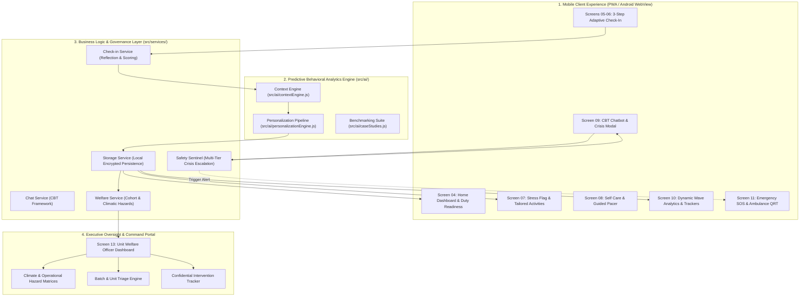
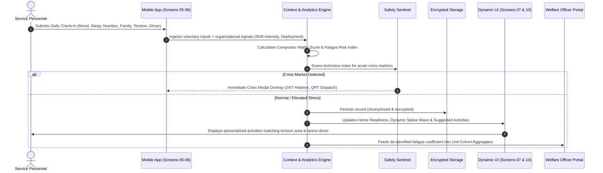

# 🐨 KOAZY — AI-Based Predictive Personnel Stress & Early-Support System
> **Defense-Grade Personnel Welfare, Behavioral Analytics & Proactive Early-Intervention Platform**  
> *Developed for Armed Forces, Central Armed Police Forces (CAPF), and High-Vigilance Defense Formations*

[](#)
[](#)
[](#)
[](#)

---

## 📋 Table of Contents
1. [Executive Summary](#-executive-summary)
2. [Problem Statement & Operational Context](#-problem-statement--operational-context)
3. [System Architecture](#-system-architecture)
   - [High-Level Architecture Diagram](#high-level-architecture-diagram)
   - [Predictive Behavioral Analytics Pipeline](#predictive-behavioral-analytics-pipeline)
   - [Multi-Signal Data Flow & Context Pipeline](#multi-signal-data-flow--context-pipeline)
4. [Core Modules & Operational Capabilities](#-core-modules--operational-capabilities)
   - [1. Mobile Wellness & Daily Self-Assessment (Screens 01–07)](#1-mobile-wellness--daily-self-assessment-screens-0107)
   - [2. Dynamic Behavioral Analytics & Wave Trajectory Engine (Screen 10)](#2-dynamic-behavioral-analytics--wave-trajectory-engine-screen-10)
   - [3. Personalized Self-Care & Guided Interventions (Screen 08)](#3-personalized-self-care--guided-interventions-screen-08)
   - [4. 24/7 CBT Chatbot & Crisis Safety Sentinel (Screen 09)](#4-247-cbt-chatbot--crisis-safety-sentinel-screen-09)
   - [5. Emergency SOS & Quick Response Dispatch (Screen 11)](#5-emergency-sos--quick-response-dispatch-screen-11)
   - [6. Welfare Officer & Commander Command Portal (Screen 13)](#6-welfare-officer--commander-command-portal-screen-13)
   - [7. Executive Companion Rails & Dual Inspection View](#7-executive-companion-rails--dual-inspection-view)
5. [Data Privacy, Security & Ethical AI Governance](#-data-privacy-security--ethical-ai-governance)
6. [Technology Stack & Design System](#-technology-stack--design-system)
7. [Repository File Structure](#-repository-file-structure)
8. [Installation & Local Deployment](#-installation--local-deployment)
9. [Operational Verification & Testing](#-operational-verification--testing)
10. [Roadmap & Future Extensions](#-roadmap--future-extensions)

---

## 🌟 Executive Summary

**KOAZY** is a specialized, privacy-first behavioral analytics and proactive welfare platform designed specifically for service personnel deployed in high-stress, geographically isolated, and operational duty environments. 

Rather than relying on reactive measures after burnout, cumulative trauma, or crises have occurred, **KOAZY identifies micro-shifts in stress, autonomic fatigue, and rest disruption through low-friction voluntary daily check-ins**, combining self-reported metrics with contextual operational indicators (shift intensity, climate extremes, sleep deficits, deployment duration).

### Key Highlights
- **100% Voluntary & Non-Punitive**: Personnel engage voluntarily without fear of stigma or career detriment.
- **Client-Side Differential Privacy**: Individual personal notes and voice memos remain on-device; commanding officers only receive anonymized, cohort-aggregated fatigue metrics.
- **Explainable AI (XAI)**: Every recommendation provides a transparent *"Why Koazy Recommended This"* rationalization citing specific verified signals.
- **Instant Intervention Closed-Loop**: When acute fatigue or stress is flagged, the system immediately suggests tailored somatic release sessions, non-sleep deep rest (NSDR), box breathing, or confidential peer/clinical listener channels.

---

## 🎯 Problem Statement & Operational Context

Defense and CAPF personnel operate under extraordinary conditions:
- **Extended High-Vigilance Deployments**: Border surveillance, counter-insurgency, and prolonged field duty create chronic sympathetic nervous system activation.
- **Harsh Climatic Stressors**: High-altitude hypoxia, sub-zero isolation, desert heatwaves, and monsoon terrain amplify psychological strain.
- **Sleep Fragmentation & Circadian Disruption**: Irregular patrol shifts, night operations, and emergency callouts degrade cognitive stamina.
- **Reluctance to Seek Formal Counseling**: Stigma surrounding mental health often prevents personnel from reaching unit welfare officers early.

**KOAZY bridges this gap** by providing an accessible, gentle, mascot-guided mobile experience that normalizes daily mental readiness checks while feeding anonymized early-warning risk signals to unit commanders.

---

## 🏗️ System Architecture

KOAZY operates on a modular, decoupled architecture consisting of an **Interactive Presentation Layer**, an **On-Device Analytics & Context Engine**, an **Explainable Decision Engine**, and an **Executive Oversight & Triage System**.

### High-Level Architecture Diagram



---

### Predictive Behavioral Analytics Pipeline



---

### Multi-Signal Data Flow & Context Pipeline

The AI engine processes two distinct data streams while maintaining strict separation between personal identity and operational metrics:

1. **Voluntary Personal Input Stream (Private & Client-Side)**:
   - **Current State of Mind**: Great (92%), Good (80%), Okay (65%), Confused (50%), Sad (35%), Stress (25%).
   - **Somatic Physical Tension**: Neck & Shoulders, Jaw & Temples, Lower Back, Chest / Breathing, No Tension.
   - **Cognitive Demands / Stress Drivers**: High-tempo shifts, Sleep fragmentation, Family separation, Terrain / Weather, Balanced & steady.
   - **Voluntary Health Habits**: Sleep duration (`<5h`, `6-7h`, `8h+`), Nutrition (`Regular`, `Skipped`, `Poor Appetite`), Family well-being (`Safe`, `Concern`).
   - **Private Reflection**: Textual reflections and encrypted voice memos.

2. **Organizational Indicator Stream (De-identified)**:
   - Deployment tenure (months in field), shift rotation density, climate severity rating, leave backlog.

3. **Composite Metrics Generated**:
   - **Composite Duty Readiness Score**: Weighted composite of Vitality (45%), Emotional Balance (40%), and Hydration/Habits (15%).
   - **Fatigue & Burnout Risk Coefficient**: Scaled metric from `0.0` (Low Strain) to `1.0` (Critical Strain).
   - **Intervention Tier**: Tier 1 (Self-directed calming), Tier 2 (Peer support check-in), Tier 3 (Welfare officer confidential follow-up), Tier 4 (Immediate clinical/medical SOS).

---

## 📱 Core Modules & Operational Capabilities

### 1. Mobile Wellness & Daily Self-Assessment (Screens 01–07)
- **Screen 01–03: Onboarding & Authentication**: Soft aesthetic introduction emphasizing privacy guarantees, non-punitive intent, and secure PIN/biometric authentication.
- **Screen 04: Home Readiness Dashboard**:
  - Greeting card with one-touch toggle between **Morning Readiness** and **Evening Wind-Down** modes.
  - Live functional status indicator (*Fit for Duty*, *Vigilant*, or *Elevated Strain*).
  - Metrics Quad-Grid: Composite Readiness %, Sleep Rhythm, Active Check-In Streak, Hydration tracker (`4/6`).
  - Dual action cards for quick daily check-in and confidential peer listener support.
- **Screen 05: State of Mind (`check_1`)**:
  - 6 curated mood cards with animated mascot expressions: **Great**, **Good**, **Okay**, **Confused**, **Sad**, **Stress**.
  - Dynamically syncs the Step 2 vitality slider and badge to ensure consistency across check-in stages.
- **Screen 06: Context & Somatic Q&A (`check_2` & `check_3`)**:
  - Operational category factors: *Family, Deployment, Sleep, Workload, Duty, Others*.
  - **Adaptive Somatic Tension Check**: Identifies where the body holds strain (trapezius, jaw, lumbar, chest).
  - **Cognitive Stamina Drivers**: Identifies specific duty pressures (tempo, isolation, weather).
  - Interactive Vitality Slider (0–100%) with real-time level badge.
  - Daily Health Indicators (Sleep hours, food intake, family safety).
  - Encrypted personal voice note recorder with simulated live waveform.
- **Screen 07: Check-In Result & Priority Activities**:
  - Dynamic **Elevated Stress Risk Banner** (activated when stress, sleep deficit, or nutrition disruption are detected).
  - **Tailored Activity Recommendations**: Prominently displays 2–3 targeted sessions matching the user's specific tension area and stress driver.
  - Direct **Start Session ▶** button on each card for immediate 1-click execution.
  - Transparent **AI Explanation Accordion**: Displays the signals used and logic behind the intervention.

---

### 2. Dynamic Behavioral Analytics & Wave Trajectory Engine (Screen 10)
- **Timeframe Selector**: Interactive switching between *Today*, *7 Days*, *30 Days*, and *3 Months*.
- **Interactive SVG Spline Curve**:
  - Smooth cubic Bézier spline mapping vitality and emotional energy over the duty day.
  - Dynamically calculates the **'Now'** check-in marker with an animated pulsing halo ring.
  - Expressive smiley markers whose mouths, eyes, and colors dynamically change based on vitality:
    - **😊 Green Smiling Face**: High vitality & positive state (≥ 75%).
    - **🙂 Yellow Neutral Face**: Balanced operational stamina (50%–74%).
    - **😣 Coral Red Downturned Face**: Elevated strain or fatigue (< 50%).
  - Smooth area gradient fill beneath the wave curve.
  - Tap/hover tooltip displaying exact timestamp, state, and vitality score.
- **Personal Habit Trackers**: Drink Up! (water increments), Sleep Duration logging, Meditation counter.
- **Recent Reflections Timeline**: Real-time chronological audit trail of all completed check-ins with emoji badges and factor tags.

---

### 3. Personalized Self-Care & Guided Interventions (Screen 08)
- **Adaptive Recovery Banner**: Dynamically highlights priority recovery goals based on the latest check-in.
- **Targeted Somatic Decompression**:
  - *Tactical Neck & Trapezoid Release (4 min)*: Relieves stiffness caused by body armor and tactical helmets.
  - *Cranial & Jaw Tension Release (3 min)*: Alleviates temporomandibular clenching from hypervigilance.
  - *Lumbar & Pelvic Decompression (5 min)*: Counteracts spine compression from standing patrols and field gear.
  - *Vagus Nerve Chest Expansion (4 min)*: Diaphragmatic expansion to release autonomic tightness in the ribcage.
- **Autonomic Pacing Sessions**:
  - *Box Breathing (4-4-4-4 Tactical Regulation, 3 min)*: Equal-ratio breathing calibrated for heart rate stabilization.
  - *NSDR (Non-Sleep Deep Rest, 12 min)*: Guided protocol restoring cognitive stamina during fragmented shifts.
  - *Barrack Sleep Soundscape (15 min)*: Calming audio environment for troop quarters.
- **Interactive Guided Modal Controller**:
  - Full-screen distraction-free modal with live countdown timer (`MM:SS`), pause/resume toggle, and animated breathing pacer circle (Inhale 4s ➔ Hold 4s ➔ Exhale 4s ➔ Rest 4s).

---

### 4. 24/7 CBT Chatbot & Crisis Safety Sentinel (Screen 09)
- **Non-Judgmental Cognitive Behavioral Therapy (CBT) Framework**:
  - Mascot counselor *Koazy* engages in empathetic dialogue focused on cognitive reframing, duty decompression, and operational grounding.
  - Quick-prompt chips for rapid interaction (*"Feeling worn out after my duty shift"*, *"Trouble sleeping"*, *"Need a calm moment"*).
- **Automated Crisis Safety Sentinel**:
  - In-memory NLP screening analyzing message sentiment for high-risk flags (hopelessness, severe trauma, self-harm signals).
  - If a risk pattern is flagged, the system immediately suspends standard dialogue and surfaces the **Crisis Safety Modal Overlay**:
    - Direct 1-tap call to 24/7 Armed Forces Helpline (`1800-555-KOAZY`).
    - Emergency contact to trusted family member.
    - Confidential dispatch alert to Unit Welfare Officer.
    - Peer listener connection channel.

---

### 5. Emergency SOS & Quick Response Dispatch (Screen 11)
- **Dual Emergency Subviews**:
  - **Emergency Help Needed (`Android Large - 18`)**:
    - Central large SOS button with orbital animation.
    - Hold-to-call gesture (1.2s safety threshold) connecting directly to medical and psychological triage lines with live audio waveform simulation.
    - Direct shortcuts to *Talk Now*, *Self-Help*, and *Schedule Therapy*.
  - **Ambulance & Quick Response Teams Away (`Android Large - 17`)**:
    - Topographic vector route map illustrating unit location and dispatched vehicle.
    - Real-time ETA pill: `🚑 8 min · 2.8 km away · Fast Route via Sector Road`.
    - Central Hospital Unit coordination card with instant call and encrypted messaging.

---

### 6. Welfare Officer & Commander Command Portal (Screen 13)
- **Unit Operational Readiness Metrics**:
  - Active personnel monitored, check-in completion compliance (e.g., 94%), average unit sleep index, and flagged fatigue cases.
- **Seasonal & Climatic Operational Stress Matrix**:
  - *High Altitude & Extreme Cold*: Hypoxia strain, cold-induced sleep disruption, isolation fatigue.
  - *Monsoon & Waterlogged Operations*: Trench foot risk, mobility fatigue, continuous moisture strain.
  - *Desert & Extreme Heatwave*: Dehydration hazards, thermal exhaustion, night-shift sleep deficits.
  - *Counter-Insurgency & Urban Vigilance*: Chronic hyperarousal, startle response fatigue, civilian-contact stress.
- **Cohort Breakdown & Batch Analytics**:
  - Segmentation by recruitment batches (e.g., *Recruits 2024*, *Mid-Career 2020*, *Senior NCOs 2015*).
  - Comparative analysis identifying whether fatigue is concentrated among junior recruits adapting to field tempo or senior personnel experiencing cumulative operational wear.
- **Confidential Case Triage & Intervention Tracking**:
  - Priority triage matrix (*Urgent Intervention*, *Pending Review*, *Active Support*).
  - Action workflow: assign welfare officers, schedule peer listeners, rebalance duty rosters.

---

### 7. Executive Companion Rails & Dual Inspection View
- **Left Rail (Personnel Dossier & Direct Jump)**:
  - Live personnel profile (Sub-Inspector Sara Sharma, Battalion 42, Sector Delta).
  - Reactive resilience score badge, stress risk coefficient, check-in streak, rest rhythm indicator.
  - Direct 1-click jump links to any of the 13 application screens.
- **Right Rail (Engine Telemetry & Simulator Controls)**:
  - Live Behavioral Engine telemetry (Engine status `ONLINE V2.4`, Climate Stress Tag, Unit Compliance Rate).
  - Simulator shortcuts: *Drink Glass of Water (+1)*, *Log Meditation (+10 min)*, *Launch Guided Pacer Modal*.
- **13-Screen Gallery Matrix**:
  - Full side-by-side inspection grid allowing evaluators and commanders to examine all 13 screens simultaneously in synchronized phone mockups.

---

## 🔐 Data Privacy, Security & Ethical AI Governance

KOAZY adheres to strict defense and government data governance standards:

```
┌────────────────────────────────────────────────────────────────────────┐
│                        DATA PRIVACY ARCHITECTURE                       │
├──────────────────────────────────┬─────────────────────────────────────┤
│ Personnel Device (Private Zone)  │ Command Portal (Aggregated Zone)    │
├──────────────────────────────────┼─────────────────────────────────────┤
│ • Private free-text diary notes  │ • Aggregated Unit Stress Index (%)  │
│ • Encrypted voice memos          │ • Cohort sleep deficit distribution │
│ • Specific mood emoji selections │ • Check-in compliance rates         │
│ • Exact physical tension areas   │ • Seasonal climate stress flags     │
│ • Local biometric/PIN lock       │ • Anonymized case tickets (RBAC)    │
│ ➔ Stored in encrypted storage   │ ➔ Zero PII or private text exposed │
└──────────────────────────────────┴─────────────────────────────────────┘
```

1. **Role-Based Access Control (RBAC)**:
   - **Personnel Role**: Full read/write access to personal logs, check-ins, guided sessions, and private reflections.
   - **Welfare Officer Role**: Access to de-identified cohort trends, triage tickets, and aggregated unit fatigue metrics. No access to private text or voice notes.
   - **Commanding Officer Role**: High-level formation readiness dashboards and climate risk summaries.
2. **Voluntary Participation Principle**:
   - Check-ins are strictly voluntary. Non-completion does not generate disciplinary flags.
3. **Transparent Explainability (XAI)**:
   - Evaluators and personnel can inspect the exact signals used by the model via the *Why Koazy Recommended This* interface.

---

## 💻 Technology Stack & Design System

KOAZY is engineered with a **zero-bloat, offline-resilient architecture** ensuring fast load times and reliable performance even on tactical networks:

- **Core Structure**: Semantic HTML5 with accessible ARIA landmarks and unique component identifiers.
- **Styling Architecture**: Vanilla CSS3 utilizing CSS Custom Properties (design tokens), flexbox, CSS grid, and GPU-accelerated transitions. Avoids heavy external CSS frameworks to eliminate compilation overhead.
- **Application Logic**: Vanilla JavaScript (ES6+ Modules) with clean separation between UI controllers, services, and AI engine pipelines.
- **Data Persistence**: HTML5 LocalStorage with structured JSON schema and encrypted state managers.
- **Vector Graphics & Mascot Art**: 100% resolution-independent SVG assets for the mascot (*Koazy*), status indicators, and navigation iconography.
- **Typography**: Dual-font typography stack via Google Fonts:
  - *Google Sans Flex / Plus Jakarta Sans*: Modern, legible typography optimized for dashboard readouts and mobile screens.
- **Palette**: Curated defense-grade stealth dark theme (`#080D0A`, `#111815`) contrasted with soothing pastel mood hues (Sage Green `#C9EBD2`, Sky Blue `#C8DAF8`, Warm Ochre `#FDEBAE`, Lavender `#E0CEF8`, Terracotta `#FFD8C4`, Coral Red `#FFA899`).

---

## 📁 Repository File Structure

```
koazy_1/
├── index.html                   # Master Application Viewport & 13-Screen DOM Tree
├── README.md                    # Project Architecture & System Documentation
├── package.json                 # Project Metadata & Development Scripts
├── assets/                      # Application Assets & Mascot Graphics
│   ├── icons/                   # Vector Icons (Shield, Bed, Heart, Breath, Duty, etc.)
│   ├── koala/                   # High-Res Mascot Graphics (Great, Good, Sad, Stress, etc.)
│   └── mascot/                  # Dialogue & Avatar SVG Artwork
├── src/                         # Core Source Code
│   ├── app.js                   # Primary Application Controller & Router
│   ├── ai/                      # Predictive Analytics & Context Engine
│   │   ├── caseStudies.js       # SIH Evaluation Scenarios & Comparative Benchmarks
│   │   ├── contextEngine.js     # Multi-Signal Contextual Aggregator
│   │   └── personalizationEngine.js # Rules-Based & Heuristic Personalization Pipeline
│   ├── services/                # Business Logic & Data Services
│   │   ├── aiService.js         # Unified AI Facade connecting UI to Analytics
│   │   ├── chat.service.js      # CBT Dialogue Engine & Dialogue Trees
│   │   ├── checkin.service.js   # Daily Reflection & Scoring Service
│   │   ├── safetyService.js     # Real-Time Safety Sentinel & Crisis Screening
│   │   ├── storage.service.js   # Persistent Local State & Anonymized Records
│   │   └── welfare.service.js   # Unit Welfare Officer & Cohort Analytics
│   └── styles/                  # Styling & Visual Design System
│       ├── ai-engine.css        # Evaluator & Judge Demo Mode Styles
│       ├── android-frame.css    # Executive Stealth Mockup & Companion Rails
│       └── app.css              # Core Design Tokens, Layouts & Mobile UI Components
```

---

## 🚀 Installation & Local Deployment

### Prerequisites
- Modern web browser (Chrome, Edge, Firefox, Safari)
- Python 3.x (or Node.js `npx serve` / static HTTP server)

### 1. Clone the Repository
```bash
git clone https://github.com/Nischal154/Koazy_AI-Based-Predictive-Personnel-Stress.git
cd Koazy_AI-Based-Predictive-Personnel-Stress
```

### 2. Launch Local Server
You can launch the project using Python's built-in static server:

```bash
# Using Python
python -m http.server 5173
```

Or using Node.js:
```bash
# Using npx serve
npx serve -l 5173
```

### 3. Open Application
Navigate to `http://localhost:5173/` in your browser.

---

## 🧪 Operational Verification & Testing

To verify the system workflow end-to-end:

1. **Daily Check-In Flow**:
   - On the Home Dashboard (Screen 04), click **CHECK-IN**.
   - On Screen 05, select **Stress** (`😣`).
   - Click **Next →** to enter Screen 06.
   - Observe that the vitality slider automatically syncs to **25% (Exhausted)**.
   - Select physical tension (*Neck & Shoulders*) and cognitive driver (*High-tempo shifts*).
   - Click **Submit Check-In**.
2. **Dynamic Recommendation Verification**:
   - Screen 07 immediately surfaces the **Elevated Stress Risk Banner**.
   - Review the tailored suggestions: *Tactical Neck & Trapezoid Release (4 min)* and *NSDR Deep Reset (12 min)*.
   - Click **Start Session ▶** to test the interactive timer and animated box-breathing pacer.
3. **Analytics Wave Reflection**:
   - Navigate to **Screen 10 (My Journal)**.
   - Verify that the wave chart spline immediately plunges down to 25% at the **Now** point with a coral stressed smiley marker and pulsing halo ring.
   - Verify the summary readout displays: `Avg Vitality: 53% • Latest: Stress (25%)`.
   - Verify that the Recent Reflections timeline displays the newly logged check-in at the top.
4. **Crisis Safety Sentinel Verification**:
   - Open **Screen 09 (Talk to Koazy)**.
   - Send a message containing acute distress signals (e.g., *"I feel completely hopeless and cannot continue"*).
   - Verify that the system instantly triggers the **Crisis Safety Modal** with direct helpline and officer escalation options.
5. **Welfare Officer Dashboard**:
   - Switch to **Screen 13 (Welfare Officer Portal)**.
   - Test seasonal stress filters (*High Altitude Winter*, *Monsoon Terrain*, *Desert Heatwave*) and observe dynamic hazard updates.

---

## 🔮 Roadmap & Future Extensions

- [ ] **Wearable Biometric Ingestion**: Optional BLE sync with defense-grade fitness bands (HRV, resting heart rate, sleep architecture).
- [ ] **Multi-Lingual Voice Support**: Voice check-ins localized in 12 regional Indian languages (Hindi, Punjabi, Bengali, Tamil, etc.).
- [ ] **Edge ML On-Device Inference**: Quantized TensorFlow Lite models running on-device for air-gapped field deployments.
- [ ] **Mesh Network Sync**: Peer-to-peer decentralized synchronization for units operating outside cellular coverage.

---

## 📄 License & Attribution
Developed for the **Smart India Hackathon (SIH 2024)** under Problem Statement **SIH 26186**.  
*All intellectual property, behavioral models, and visual design assets are maintained for non-commercial defense and personnel welfare research.*
